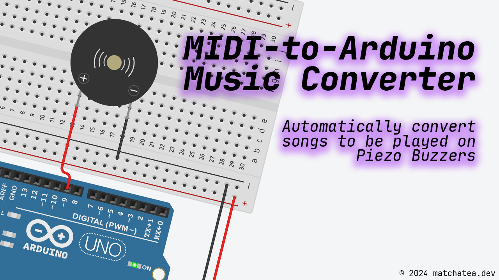

# MIDI-to-Arduino

This is a simple Python script that converts a MIDI file into an Arduino sketch that plays the MIDI file on a Piezo buzzer. This was made originally for a school project, but I decided to make it public for anyone who wants to use it.

## Usage

1. Activate the virtual environment by running `source venv/bin/activate`.
2. Move the MIDI file you want to convert into the `midi` directory.
3. Edit `main.py` to use the correct MIDI file.
4. Run `python main.py`.
5. In the Arduino IDE, open the `playMelody.ino` sketch and upload it to your Arduino.
6. Connect a piezo buzzer to pin 8 and ground on your Arduino.
7. Power the Arduino and listen to the melody!
